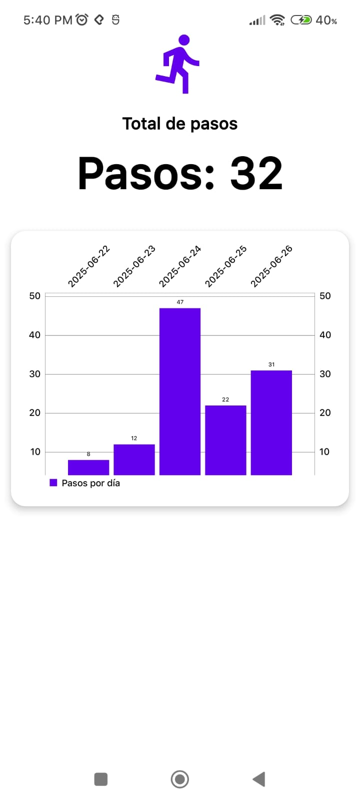

# App Contador de Pasos con Acelerómetro

Esta aplicación para Android permite contar los pasos diarios utilizando el acelerómetro del dispositivo. Además, muestra un historial visual de los pasos registrados por día mediante un gráfico de barras.

## Funcionalidades principales

- **Conteo de pasos en tiempo real:** Utiliza el sensor acelerómetro para detectar y contar los pasos del usuario.
- **Historial de pasos:** Guarda automáticamente el número de pasos diarios y los muestra en un gráfico de barras.
- **Visualización clara:** Muestra el total de pasos del día y un gráfico con los pasos de días anteriores, con los valores enteros visibles sobre cada barra.

## Tecnologías utilizadas

- **Kotlin** para el desarrollo de la app.
- **SensorManager** de Android para acceder al acelerómetro.
- **SharedPreferences** para almacenar el conteo de pasos diarios.
- **MPAndroidChart** para la visualización de gráficos.
- **Android SDK** (API 24+).

## Instalación y uso

1. Clona este repositorio y ábrelo en Android Studio.
2. Conecta un dispositivo físico o usa un emulador con sensor de acelerómetro.
3. Compila y ejecuta la aplicación.

## Estructura principal del proyecto

- `MainActivity.kt`: Lógica principal de conteo de pasos y visualización.
- `activity_main.xml`: Interfaz de usuario.
- `colors.xml`: Paleta de colores de la app.

## Notas

- El conteo de pasos depende de la sensibilidad del acelerómetro y puede variar según el dispositivo.
- Los datos de pasos se almacenan localmente en el dispositivo.

---

Desarrollado como ejemplo de uso de sensores y gráficos en Android.

